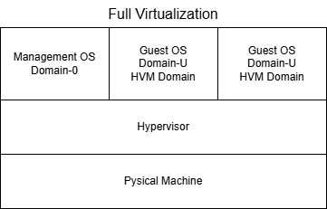
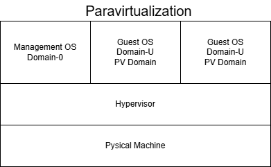
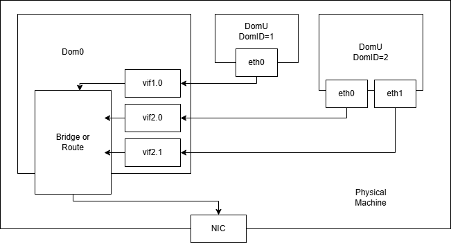

## 【Xen】
#### Xen is virtualization software originally developed as a research project at the University of Cambridge Computer Laboratory. Initially, it supported only paravirtualization, but since the release of Xen 3.0 in December 2005, it has supported full virtualization. Today, it is an open-source virtualization software supported by many Linux distributions.

#### Xen supports live migration, which allows a running virtual machine to be moved to another physical machine without downtime, enabling highly available and flexible operations.

### ■ Xen Architecture
#### Xen is a hypervisor-type (Type 1) virtualization software. It places a virtualization layer known as the "Xen Hypervisor" directly on the hardware to control multiple operating systems. Below are the structural diagrams for Xen’s paravirtualization and full virtualization:

### ■ Xen Virtual Machines (Domain-0, Domain-U)
#### In Xen, virtual machines are referred to as "domains." There are two types of domains in Xen: "Domain-0" and "Domain-U."

* Domain-0 (Dom0): A privileged domain that has the authority to control Domain-U. It functions as the host OS. Only one Domain-0 can be created per physical machine.

* Domain-U (DomU): Domains used for installing and running guest OSs. Multiple Domain-U instances can exist.

#### About PV and HVM,

* PV (ParaVirtualized) Domain: A Domain-U utilizing paravirtualization.

* HVM (Hardware-based Virtual Machine) Domain: A Domain-U utilizing full virtualization.

#### Basically, PV and HVM domains can be managed and operated uniformly without distinction. For example, starting/stopping domains and allocating virtual resources (such as CPU and memory) are performed using toolstacks like xl or libvirt.
#### (Note: Xen toolstacks are explained in the separate section 【Xen Management Tools】).

#### Mainly Linux is used for the OS in Domain-0; Windows and macOS cannot be used. For PV Domains, Linux is primarily used because the OS kernel requires modification. For HVM Domains, various operating systems, including Windows, can be used.
#### (Note: For the differences between paravirtualization and full virtualization, please refer to the "Virtualization Concepts and Theory" section).

## 【Xen Paravirtualization and Full Virtualization】
#### In Xen, you can choose between paravirtualization and full virtualization for each virtual machine.

### ■ Paravirtualization (PV)
#### In the Xen paravirtualization mechanism, access to physical devices from a Domain-U uses special paravirtualization-aware device drivers (frontend drivers). Requests are transferred via the hypervisor to the backend drivers (virtual device drivers) within Domain-0. The backend drivers then pass these requests to the Linux device drivers, which access the physical hardware to execute the requested tasks.

#### Paravirtualization does not perform hardware emulation. To access hardware such as network or disk devices, guest OSs use frontend drivers to achieve high-speed I/O processing. Therefore, each guest OS must have an implementation of these frontend drivers. Additionally, because the guest OS requires modification during installation, it is generally limited to open-source operating systems like Linux.

### ■ Full Virtualization (HVM)
#### Full virtualization emulates computer hardware to create a complete logical computer on a virtual machine. Consequently, each domain can use the standard device drivers already available for that hardware as-is. Unlike paravirtualization, special frontend drivers are not strictly required for basic operation.

#### Furthermore, because full virtualization does not require modifications to the guest OS source code, it is possible to install Windows as a guest OS. However, realizing full virtualization requires hardware-assisted virtualization features in the CPU, such as Intel VT or AMD-V.

## 【Xen Network Configuration】
#### The network configuration for Xen 4.1 and later is as follows:

#### While a standard network interface (e.g., "eth0") is visible from the Domain-U side, Xen internally treats this as the frontend for the Domain-U. On the Domain-0 side, a corresponding backend interface called "vif" is created. These interfaces are assigned unique identifiers such as vifX.Y, where X is the Domain ID and Y is the interface index (starting from 0).

#### After passing through Domain-0, communication is directed to the actual physical NIC via Bridging or Routing, depending on the Domain-0 configuration.

## 【Summary of Main Xen Features】
#### The key characteristics of Xen are as follows:
* Hypervisor-type virtualization software.
* Supports both paravirtualization (PV) and full virtualization (HVM).
* Places a virtualization layer on the hardware to manage and control multiple OSs.
* Refers to virtual machines as "Domains" (Domain-0 and Domain-U).
* PV and HVM virtual machines can be managed collectively, except for a few specific functions.
* Virtual resources such as CPU, memory, and NICs can be allocated to virtual machines in both virtualization types.
* Virtualization type (PV or HVM) can be selected per virtual machine.
* Paravirtualization requires modifications to the guest OS.
* Full virtualization requires CPU virtualization extensions (Intel VT or AMD-V).
* Supports live migration to move running virtual machines to different physical hosts.