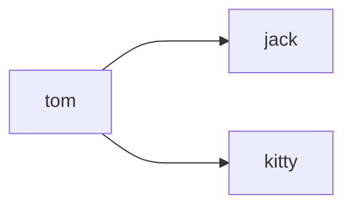

# this is a file to document some very basic mermaid code.

### Before you use mermaid, you should install some essential extensions first, so you won't suffer like I did. ：）

## Some EXTENSIONS that you will need.
### 1. press "ctl + shift + X" to open the extension store.
### 2. install "Markdown Preview Mermaid Support" to enable Preview function.
### 3. install "Mermaid Markdown Syntax Highlighting" to enable Syntax highlighting.
###
### Just do as what I told you here, and you will save a lot of tears.
### Without all these extentions, you will be like running in total darkness. Don't even try it, trust me.

